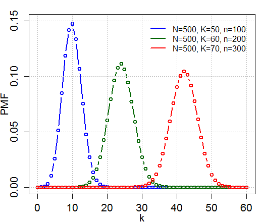

```{r setup, echo = FALSE, message = FALSE, warning = FALSE}
options(scipen = 1, digits = 4, width = 80)
library(knitr)
library(tidyverse)
library(Rlab)
download.file(url="https://upload.wikimedia.org/wikipedia/commons/c/c1/HypergeometricPDF.png", 
              destfile="image.png", mode='wb')
```
## Exercise 1 Solution:
I have followed the tasks listed in Exercise 1.

## Exercise 2 Solution: 
1. My name is Vasiliy. I am 20 years old.
2. **My name is Vasiliy.**  
*I am 20 years old.*
3. My favorite website is Craigslist. 
    (a) [My favorite website](https://craigslist.org)
    (b) https://craigslist.org
4. The pound, or hashtag, symbol is used to denote headers.
5. Write a quoted statistics or probability joke.

 > Girlfriend: Our love is like a Poisson distribution, rare and special. Out of all the men in the world, we found each other.  
 > Boyfriend: Hmm, I think I'd describe it more like a geometric distribution. I failed with all the other women in our class but I knew there would eventually be a success...you! 

6. Computer type for running 3+2: `3+2`
7. Write a bulleted list of top 3 reasons you chose this course.
    * I want to learn new methods in computational statistics to use for my job.
    * I want to learn about fields to which computational statistics is applied and what problems it solves.
    * I want to take another course with Professor Ravat.
8. Write an itemized list of your top three fears in this course. You may use sub-lists if necessary!
    * Fear 1: Not mastering the material for a good grade
    * Fear 2: Missing an assignment or deadline by mistake
    * Fear 3: Tripping and falling when entering the PSTAT 194CS classroom
9.  Image insertion test:  

10. Can you find a way to resize the image in RMarkdown?  
{#id .class width=20% height=20%}
11. A, B, C code chunks  
A -> no code, yes run, yes results
```{r, echo=FALSE}
print(3+2)
```

B -> yes code, no run, no results
```{r, eval=FALSE}
print(3+2)
```

C -> no code, yes run, no results
```{r, echo=FALSE, results="hide"}
print(3+2)
```

12. $L(\theta) = \prod_{i=1}^n p^{X_i} (1-p)^{1-X_i}$
13. Doing this exercise took an incredibly long amount of time for me.

## Exercise 3 Solution: 
1. True/**False**: Discord should be used as much as possible for questions pertaining to course administration and general course information.
2. True/**False**: Email is the fastest way to get questions related to homework as well as general questions answered.
4. True/**False**: The exam dates and location are
    * Exam 1: Week 7, Thursday, May 5, in IV Theater
    * Exam 2: Week 10, Friday, June 3, in class
5. True/**False**: Homework may be sent to `instructor@pstat.ucsb.edu` via email. 
6. True/**False**: Homework and exams can be he made up after the deadline by sending an email to the instructor or the TA requesting this. Such emails will be answered instantly.

## Exercise 4 Solution:  
R has a built-in matrix of different types of data of every US state, ``state.x77``. Use this matrix and R's built in functions and **vector calculation** to perform the following tasks.  You will also need `rownames(state.x77)` to get the state names and R's character functions to manipulate them (refer [here](http://www.statmethods.net/management/functions.html) or google).
```{r}
data = state.x77
```

(a)  What is the longest state name (including spaces) and how long is it?
```{r}
longest_name = rownames(data)[which.max(nchar(rownames(data)))]
print(longest_name)
print(nchar(longest_name))
```

(b)  List all the states that are more then one word.  How many are there?
```{r}
state_names = strsplit(rownames(data), c(" "))[lengths(strsplit(rownames(data), c(" "))) == 2] %>% 
  sapply(paste, collapse=" ")
print(state_names)
print(length(state_names))
```

(c)  List  all  the  US  State names,  where  all  of  the  upper  and  lower  case  `a's`  are
replaced with a capital `Z`.
```{r}
rownames(data) %>% 
  sapply(gsub, pattern="a", replacement="Z", ignore.case=TRUE) %>% 
  unname()
```

(d) Output only the second column of the matrix and store it in the numeric vector ``capita``. This vector indicates the per capita income (1974) of every US states.
```{r}
capita = data[, 2]
capita
```

(e) What is the average per-capita income of the US (1974)?
```{r}
mean(capita)
```

(f) What is the average per-capita income of the states that have names that are more than one word?
```{r}
mean(capita[state_names])
```

(g) Which state has the highest per-capita income?
```{r}
capita[which.max(capita)]
```

## Exercise 5 Solution: 

### Definitions  

1. A random variable $X$ is a function which maps values from the sample space to values in the state space.  
2. Random variables are either discrete or continuous.  
3. The distribution of a random variable is the probability the RV will take on some value, recorded over all possible values.  
4. The probability mass function (pmf) is a function which gives the probability that a discrete RV is exactly equal to some value. The probability density function (pdf) is a function whose value at any given point in the sample space provides a relative likelihood that the value of a continuous RV would be close to that point. In essence, because a continuous RV can take on an infinite range of values, the probability of it being exactly some value becomes 0. Thus we must approximate an exact probability by looking at some infinitesimaly-small interval. The cumulative distribution function (cdf) is a function which gives the probability that an RV takes on a value less than or equal to some value.  
5. Discrete $E[X] = \sum_x x p(x)$. Continuous $E[X] = \int_{-\infty}^{\infty} x f(x) dx$. Variance $V[X] = E[(X - E[X])^2]$. Median x satisfies $\int_{-\infty}^{x} f(x) dx = .5$. Mode is the solution of $argmax$ $f(x)$. 
6. Bernouli RV (discrete example 1) has parameter $0<p<1$, pmf $p(x) = p^x (1-p)^{1-x}$, $E(X) = p$, and $var(X) = p(1-p)$. Poisson RV (discrete example 2) has parameter $m$, pmf $p(x) = e^{-m} m^x / x!$, $E(X) = m$, and $var(X) = m$. Exponential RV (continuous example 1) has parameter $l$, pdf $f(x) = le^{-lx}$, $E(X) = 1/l$, and $var(X) = 1/l^{2}$. Uniform RV (continuous example 2) has parameters $a, b$, pdf $f(x) = 1/(b-a)$, $E(X) = (a+b)/2$, and $var(X) = (b-a)^2 /12$.
7. Plot the above random variables in `R`.
```{r}
par(mfrow=c(2, 2))
x = 0:20
{
  plot(dbern(x, prob=0.5), type="o", main="Bernoulli RV, p=0.5")
  plot(dpois(x, lambda=2), type='o', main="Poisson RV, m=2")
  plot(dexp(x, rate=0.5), type="l", main="Exponential RV, l=0.5")
  plot(dunif(x, min=5, max=15), type="l", main="Uniform RV, a=5, b=15")
}
```

### Sampling distributions and estimation

8. Independent and Identically Distributed (iid) RVs are random variables which follow the same distribution and are independent of each other. One area of statistics where we see iid RVs is random sampling. If we pick a certain number of RVs from the same population randomly (every RV has an equal chance of being chosen), we essentially arrive at a sequence of iid RVs.
9. A statistic is a number which describes a sample. Two examples of this are the sample mean and the sample standard deviation.
10. An estimator is a statistic that is used to infer the value of some unknown parameter of a distribution or statistical model. Two examples of this are using the sample mean as an estimator for the population mean and using the sample standard deviation as an estimator for population standard deviation.
11. $bias(\hat\theta) = E(\hat\theta) - \theta$
12. Var and SE of estimator.  
$var(\hat\theta) = E((\hat\theta - E(\hat\theta))^2)$  
$SE(\hat\theta) = var(\hat\theta)^{1/2}$  
13. $MSE_\theta(\hat\theta) = E((\hat\theta - \theta)^2)$  
14. $MSE_\theta(\hat\theta) = var(\hat\theta) + (bias(\hat\theta))^2$  
15. MOM and MLE both help you estimate population parameters from sample data. MOM works by writing down as many moments of the population distribution as there are parameters to be estimated. We then solve for each parameter as a function of its moment. Finally, we replace the population moments with estimators that we have from our sample. MLE works by writing down the joint pmf/pdf of a sequence of iid RVs (your random sample). We then use calculus to find the parameter estimates which maximize the "likelihood" function.
16. If we wanted to model some two-dimensional data with a simple linear regression model, we could write down the likelihood function using our sample and the fact that the random errors are normal (mean 0, variance sigma-squared), and calculate the estimates for our two parameters which maximize the likelihood. Then we could plot our regression line.
